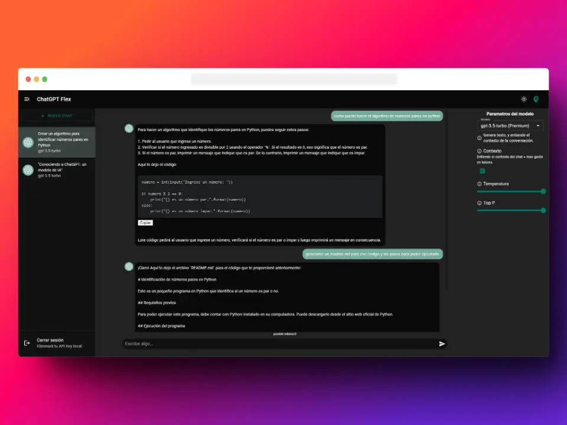

<h1 align="center">ChatGPT Flex</h1>
<h2 align="center">Premium quality UI for ChatGPT</h2>
<!-- 
<a href="https://chatpad.ai">Web App</a> & <a href="https://download.chatpad.ai">Desktop App</a>
 -->

<a href="https://chatflex.hebertdev.net">Web App</a> 

This app is a user interface that simplifies the use of the OpenAI API to interact with the GPT-3 and GPT-4 engines. Thanks to an easy-to-use interface, users can create content and perform tasks more quickly and efficiently.

### ⚡️ Free and open source

This app is provided for free and the source code is available on GitHub.

### 🔒 Privacy focused

No tracking, no cookies, no bullshit. All your data is stored locally.

### ✨ Best experience

Crafted with love and care to provide the best experience possible.

## Give Feedback

If you have any feature requests or bug reports, go to [Twitter|hebertdev](https://twitter.com/hebertdev1).

## Contribution

This is a React.js application built with Vite and TypeScript. To run the project, clone it and run the following commands:

`npm install`
`npm run dev`

And you're good to go to start contributing!

## Credits

- [MUI](https://mui.com/) - A fully featured React component library
